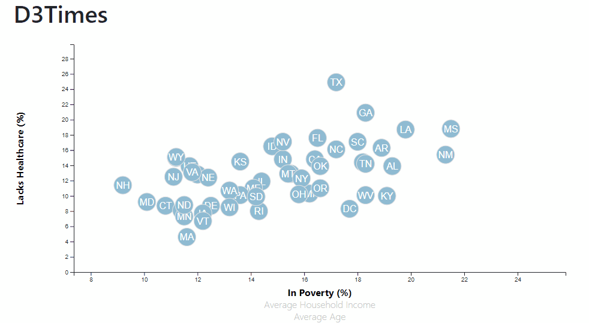

# d3-challenge
D3 plotting challenge for Dataviz at UNCC.

## How to use
Find access to the app <a href="https://jakegeiser.github.io/d3-challenge/">HERE</a>. The image below shows the use.

The graph has a data point for all 50 states and Washington D.C. You can use it to view correlations for the percentage of residents with healthcare and their average income, average age, and percentage in poverty.

## Files included
The Given directory had starter code to work on this yourself. All of the other files are part of the solution excluding images/appDynamic.gif which just shows the app working and is the image above. The app's index.html is the base html file and the assets directory has the javascirpt, css, and dataset used by the app.
